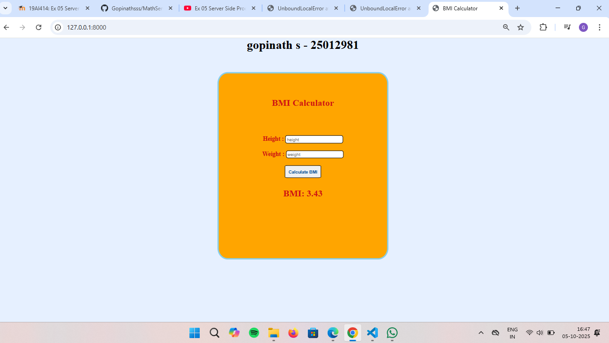

# Ex.05 Design a Website for Server Side Processing
## Date:05/10/2025

## AIM:
 To design a website to calculate the power of a lamp filament in an incandescent bulb in the server side. 


## FORMULA:
BMI = W/(H/100)**2
<br> BMI --> Body Mass Index
<br> W --> Weight
<br> H --> Height

## DESIGN STEPS:

### Step 1:
Clone the repository from GitHub.

### Step 2:
Create Django Admin project.

### Step 3:
Create a New App under the Django Admin project.

### Step 4:
Create python programs for views and urls to perform server side processing.

### Step 5:
Create a HTML file to implement form based input and output.

### Step 6:
Publish the website in the given URL.

## PROGRAM :
```
math.html
<html>

<head>
    <title>BMI Calculator</title>
    <style>
        body {
            background-color: rgb(230, 240, 255);
            font-size: large;
            color: rgba(209, 19, 19, 1);
        }


        * {
            padding: 0px;
            margin: 0px;
        }

        #box {
            border: 4px solid skyblue;
            width: 500px;
            height: 550px;
            border-radius: 6%;
            display: flex;
            flex-wrap: nowrap;
            flex-direction: column;
            gap: 30px;
            position: absolute;
            top: 45%;
            left: 50%;
            transform: translate(-50%, -50%);
            background-color: orange;
            
        }

        h1 {
            color: rgba(0, 0, 0, 1);
        }

        .btn {
            padding: 10px;
            font-size: small;
            font-weight: bold;
            border-radius: 8%;
            border: solid 2px rgb(0, 0, 0);
            color:rgb(0, 76, 153);
        }

        .values {
            border-radius: 6px;
            border: solid 2px rgb(0, 0, 0);
            padding: 5px;
        }
    </style>
</head>

<body>
    <center>
        <strong>
            <h1>gopinath s - 25012981</h1>
        </strong>
        <div id="box">
            <br><br>
            <h2>BMI Calculator</h2>
            <br>

            <form method="POST">
                
                <strong><label for="height">Height :</label></strong>
                <input type="text" id="height" name="height" placeholder="height" style="padding:3px;" class="values"
                    required>
                <br>
                <br>
                <strong><label for="weight">Weight :</label></strong>
                <input type="text" id="weight" name="weight" placeholder="weight" style="padding:3px;" class="values"
                    required>
                <br>
                <br>
                <input type="submit" value="Calculate BMI" class="btn">
            </form>
            
            <h2> BMI: {{ bmi }}</h2>
            
            <p>Category: {{ category }}</p>
            
            
        </div>
    </center>
</body>

</html>
view.py
from django.shortcuts import render
from django.shortcuts import render

def bmi_calculator(request):
    bmi = None
    category = None
    if request.method == 'POST':
        try:
            height = float(request.POST.get('height')) / 100
            weight = float(request.POST.get('weight'))
            bmi = round(weight / (height ** 2), 2)
            print(f" Height: {height * 100} cm \n Weight: {weight} kg \n BMI: {bmi}")
        except (ValueError, ZeroDivisionError):
            print("Invalid input received.")
            bmi = "Invalid input"
            category = None
    return render(request, 'mathapp/math.html', {'bmi': bmi, 'category': category})

url.py
from django.contrib import admin
from django.urls import path
from mathapp.views import bmi_calculator

urlpatterns = [
    path('admin/', admin.site.urls),
    path('', bmi_calculator, name='bmi_calculator'),
]

```

## SERVER SIDE PROCESSING:


## HOMEPAGE:


## RESULT:
The program for performing server side processing is completed successfully.
